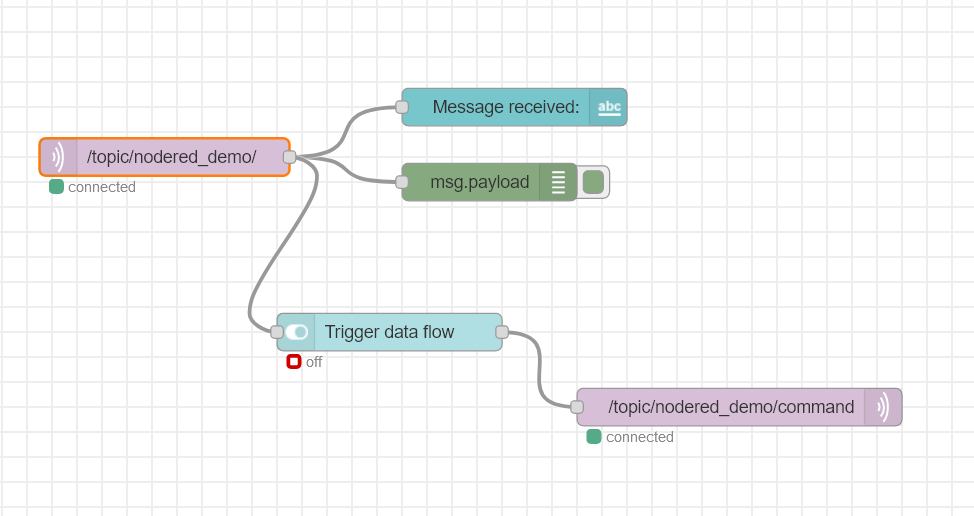
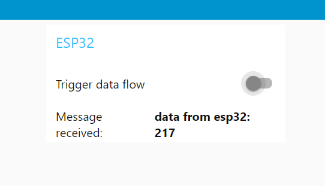
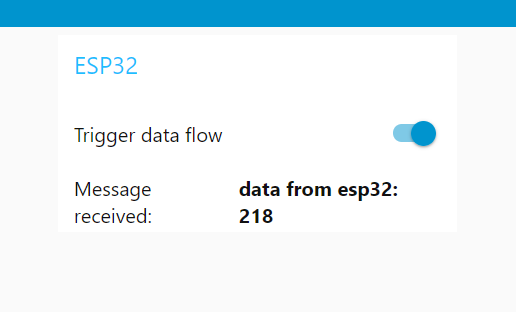
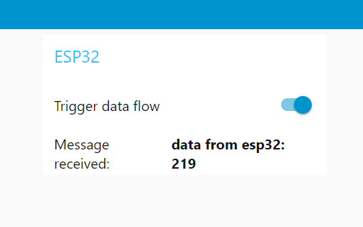

# ESP32 - MQTT - Node-Red Integration Project

**Authors:**  Mike Camara, Helen Tera & Lino Mediavilla.

**Instructor:** Jaanus Kaugerand.

## ESP32 side
- It builds on the previous examples built over the course.
- We have a queue for communication between `producer` and `publisher` tasks.
- We defined a global variable to toggle data production on/off.
- In the `mqtt_event_handler_cb` function, we `switch` on the `event_id` and in the case of `MQTT_EVENT_DATA`, we perform the necessary checks and update the `enableProduce` variable as requested by the message payload.
- The producer task periodically checks `enableProduce` to know if it must produce or just sleep.

## Node-Red side

The following node-red flow was implemented. 
- Details to connect to our broker deployed on Digital Ocean are set on the mqtt_in and mqtt_out nodes. 
- There is a topic for receiving data from the client, and another to send a command to toggle data production.

    

    Data Production off:

     

    Data Production on:

     

     

